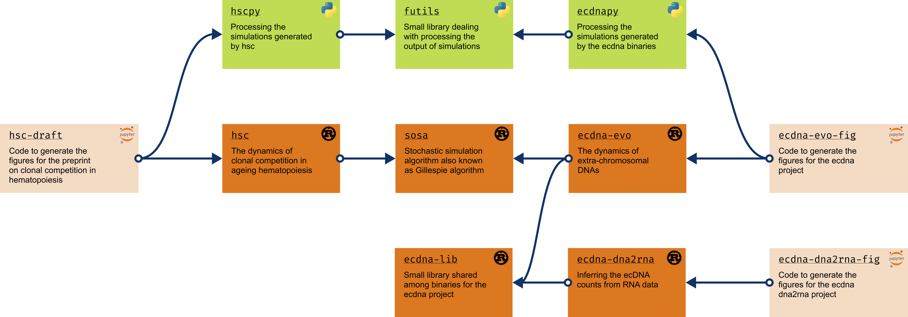

## Hi there 👋
Data Scientist applying Machine Learning and Probabilistic Modelling to uncover recurrent patterns in multidimensional clinical data.
 
I organised my PhD code in a modular way to reuse it in different projects.
Have a look below!
<!--
**fraterenz/fraterenz** is a ✨ _special_ ✨ repository because its `README.md` (this file) appears on your GitHub profile.

Here are some ideas to get you started:

- 🌱 I’m currently learning ...
- 👯 I’m looking to collaborate on ...
- 🤔 I’m looking for help with ...
- 💬 Ask me about ...
- 📫 How to reach me: ...
- 😄 Pronouns: ...
- ⚡ Fun fact: ...
- 🔭 I’m currently working on ...
-->

